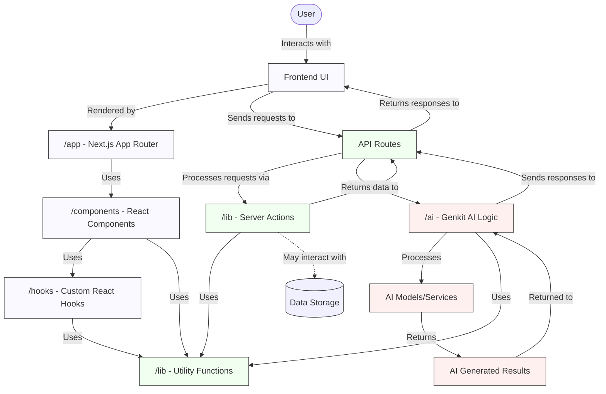

# Teacher AI Education Studio

This is a NextJS application with AI-powered education tools designed to revolutionize the teaching and learning experience for educators and students.

## Purpose & Value Proposition

The AI Education Studio serves as a comprehensive platform for educators to leverage AI in transforming their teaching practices. This application:

- **Empowers Educators** with AI-driven analytics and content creation tools
- **Personalizes Learning** by analyzing student data and creating differentiated resources
- **Saves Time** by automating routine tasks like lesson planning and worksheet creation
- **Enhances Engagement** through interactive, customized educational content
- **Improves Outcomes** by identifying learning gaps and recommending targeted interventions

## Features

### Student Analyzer Tool
The Student Analyzer tool provides comprehensive analysis of student performance with interactive visualizations:

- **Performance Overview**: View student strengths and weaknesses with radar charts
- **Subject Trends**: Track performance over time with line charts
- **Improvement Areas**: Get targeted recommendations with priority indicators
- **Skills Assessment**: Visualize skill distribution and growth
- **Customizable Visualizations**: Choose between simple, detailed, or comprehensive data presentations
- **Multiple Chart Types**: Bar charts, line charts, radar charts, and more
- **Color Themes**: Select from different visual themes (default, monochrome, vibrant)

### Lesson Planner Tool
Create comprehensive, standards-aligned lesson plans with AI assistance:

- **Customizable Templates**: Select from various lesson plan formats
- **Curriculum Alignment**: Automatically align content to educational standards
- **Differentiation Options**: Generate variations for different learning levels
- **Resource Suggestions**: Get AI-recommended teaching materials
- **Interactive Elements**: Incorporate engaging activities and assessments

### Simple Explainer Tool
Break down complex concepts into easy-to-understand explanations:

- **Vocabulary Leveling**: Adjust language complexity based on grade level
- **Visual Aids**: Generate accompanying diagrams and illustrations
- **Analogies & Examples**: Create relatable comparisons for abstract concepts
- **Step-by-Step Breakdowns**: Convert complex processes into sequential steps
- **Concept Maps**: Visual representations of related ideas and connections

### Interactive Games Tool
Generate educational games that reinforce learning objectives:

- **Multiple Game Types**: Quizzes, word puzzles, matching games, and more
- **Curriculum Integration**: Games tied directly to learning objectives
- **Difficulty Scaling**: Automatically adjust complexity for different learners
- **Engagement Mechanics**: Points, challenges, and progress tracking
- **Printable Options**: Generate games for both digital and physical use

### Local Story Tool
Create culturally relevant stories that connect with students' backgrounds:

- **Cultural Adaptation**: Stories featuring local settings and references
- **Language Customization**: Incorporate local dialects and expressions
- **Value Integration**: Embed cultural values and traditions
- **Illustration Generation**: Create culturally appropriate accompanying images
- **Discussion Prompts**: Generate related questions for classroom conversations

### Differentiated Worksheets Tool
Generate custom worksheets for different learning levels:

- **Multiple Difficulty Levels**: Create tiered assignments for the same concept
- **Visual Adaptations**: Adjust layout and design for different learning needs
- **Question Variety**: Mix multiple question types (multiple choice, short answer, etc.)
- **Scaffolding Options**: Include varying levels of support for different learners
- **Answer Keys**: Auto-generate solutions for teacher reference

### Additional Tools
- **PDF Text Extractor**: Extract and analyze text from educational documents
- **Image Text Extractor**: Convert handwritten or printed text from images
- **Audio Generator**: Convert text content into spoken audio for accessibility
- **Chat with Sources**: Intelligent Q&A with educational materials and references

## Getting Started

### Running the Application

1. To start the Next.js development server:
   ```
   npm run dev
   ```
   
2. To start with the Student Analyzer tool:
   ```
   run_student_analyzer.bat
   ```

3. To start the Genkit development server:
   ```
   npm run genkit:dev
   ```

## Application Architecture

### Tech Stack
- **Frontend:** React with Next.js App Router
- **Backend:** Next.js API routes
- **AI Framework:** Genkit
- **Styling:** Tailwind CSS
- **Build Tools:** TypeScript, PostCSS
- **Package Management:** npm
- **Deployment:** Configured via apphosting.yaml

### Project Structure

```
New_AI_Notebook/
│
├── src/                     # Source code directory
│   ├── app/                 # Next.js App Router pages and routing
│   ├── ai/                  # Generative AI logic with Genkit framework
│   │   └── flows/           # AI workflow definitions
│   ├── components/          # Reusable React components
│   │   ├── chat/            # Chat interface components
│   │   ├── layout/          # Layout components
│   │   ├── sources/         # Source management components
│   │   ├── studio/          # Studio interface components
│   │   │   └── tools/       # Educational tool components
│   │   └── ui/              # UI component library
│   ├── hooks/               # Custom React hooks
│   └── lib/                 # Utilities, actions, and schemas
│
├── docs/                    # Project documentation
├── public/                  # Static assets
└── [config files]           # Configuration files (package.json, next.config.ts, etc.)
```

### Application Workflow



### End-to-End Workflow

1. **User Interaction**
   - User accesses the application through the browser
   - Next.js App Router (`/src/app`) handles routing and page rendering
   - Components from `/src/components` build the interface

2. **Frontend Processing**
   - UI components use hooks from `/src/hooks` for state management
   - Components import and use UI library elements from `/src/components/ui`
   - Studio tools (`/src/components/studio/tools`) provide educational features

3. **AI Integration**
   - User requests for AI features are processed through the Genkit framework
   - AI flows in `/src/ai/flows` define the behavior of different AI tools
   - The Student Analyzer and other educational tools use these flows

4. **Data Processing**
   - Server actions in `/src/lib` handle data processing and API calls
   - Utility functions provide shared functionality across components
   - PDF processing uses dedicated utilities in `/src/lib/pdf.ts`

5. **Response Handling**
   - AI-generated results are returned to the frontend
   - Charts and visualizations display student performance data
   - UI updates to show recommendations and insights

### Key Functionality

#### Student Analyzer
- Takes student performance data as input
- Processes data through AI models via Genkit
- Generates visualizations with various chart types
- Provides targeted recommendations for improvement

#### Other Educational Tools
- **Lesson Planner:** Creates customized lesson plans
- **Simple Explainer:** Provides simplified explanations of complex concepts
- **Interactive Games:** Generates educational games for engagement
- **Local Story Tool:** Creates stories with local context

### Deployment Process
1. Build the application with `npm run build`
2. Configuration is managed through `apphosting.yaml`
3. Deploy to your hosting platform of choice

## User Benefits & Use Cases

### For Teachers
- **Time-Saving**: Reduce preparation time by automating lesson planning, worksheet creation, and student data analysis
- **Personalization at Scale**: Create differentiated materials for diverse classrooms without the typical manual effort
- **Data-Driven Instruction**: Make informed teaching decisions based on comprehensive student performance analytics
- **Creative Inspiration**: Overcome creative blocks with AI-assisted content generation
- **Professional Development**: Access modern teaching approaches and methodologies embedded in the AI recommendations

### For School Administrators
- **Standardization**: Ensure consistent quality across classrooms with AI-guided resources
- **Resource Optimization**: Allocate teaching resources more effectively based on detailed student performance data
- **Innovation Support**: Provide teachers with cutting-edge tools that enhance teaching without overwhelming training
- **Cultural Relevance**: Ensure educational materials reflect the specific cultural context of your school community

### For Students
- **Personalized Learning**: Receive materials tailored to individual learning styles and needs
- **Engagement**: Interact with customized, relevant content that connects to personal interests and backgrounds
- **Immediate Feedback**: Get targeted recommendations for improvement based on performance analysis
- **Accessibility**: Access content in multiple formats (visual, audio, simplified text) to suit learning preferences

### Common Use Cases

#### Differentiated Classroom Instruction
1. Teacher uploads student assessment data to the Student Analyzer
2. The system identifies learning gaps and strengths for each student
3. Teacher uses the Differentiated Worksheets Tool to generate tiered assignments
4. Students receive personalized materials matching their learning needs

#### Cultural Relevance Integration
1. Teacher inputs local cultural context information
2. The Local Story Tool generates narratives incorporating familiar settings and values
3. Stories are used to introduce new concepts with culturally relevant examples
4. Students engage more deeply with material that reflects their lived experiences

#### Intervention Planning
1. Administrators review Student Analyzer dashboards across multiple classrooms
2. System identifies common skill gaps across student populations
3. The Simple Explainer Tool generates targeted materials for those specific skills
4. Intervention groups receive focused instruction with materials at appropriate complexity levels

#### Engaging Review Sessions
1. Teacher selects curriculum topics for review
2. The Interactive Games Tool generates educational games reinforcing those concepts
3. Students engage with the material through competitive or collaborative gameplay
4. Learning is reinforced through active, enjoyable interaction with content

## Additional Application Details

### Folder & File Descriptions

- **/src/app/**: Main application logic, routing, and page components using Next.js App Router. Handles navigation and layout for the entire application.
- **/src/ai/**: All AI and Genkit logic. The `flows/` subfolder contains TypeScript files that define specific AI-powered workflows (e.g., analyzing student performance, generating worksheets, extracting text from images or PDFs, generating audio, lesson plans, games, and stories).
- **/src/components/**: All reusable React components. Subfolders:
  - `chat/`: Chat-based interaction components.
  - `layout/`: Layout and structure components.
  - `sources/`: Managing and displaying educational sources.
  - `studio/`: Main studio dashboard and tool panels.
    - `tools/`: Individual tools (games, lesson planner, explainer, etc.).
  - `ui/`: UI primitives (buttons, dialogs, forms, tables, etc.).
- **/src/hooks/**: Custom React hooks for state management and utility logic (e.g., media queries, toast notifications).
- **/src/lib/**: Shared utilities, server-side actions, and data schemas. Includes logic for PDF processing, validation, and backend utilities.
- **/docs/**: Project documentation and blueprints for architecture and features.
- **/public/**: Static assets such as images, icons, and files served directly by Next.js.
- **Configuration Files (root)**: `package.json`, `next.config.ts`, `tailwind.config.ts`, `postcss.config.mjs`, `tsconfig.json`, `apphosting.yaml`, and `run_*.bat` scripts for running the app or specific tools on Windows.

### Extensibility
- Modular structure (with flows, components, and tools) allows for easy addition of new AI-powered features or educational tools.
- The UI library in `/src/components/ui/` ensures consistent design and rapid development.

### Security & Privacy
- Designed to process educational data securely.
- Sensitive student data should be handled according to privacy best practices and relevant regulations (e.g., FERPA, GDPR).

### Customization
- Visual themes and chart types can be customized for different classroom needs.
- Tools can be adapted for various curricula, languages, and cultural contexts.

### Example User Flows

#### Teacher Workflow Example
1. Upload class test results to the Student Analyzer.
2. Receive a dashboard of strengths/weaknesses and generate targeted worksheets for each group.
3. Use the Lesson Planner to create a standards-aligned lesson plan for the next week.
4. Generate a local story or interactive game to reinforce a difficult concept.

#### Administrator Workflow Example
1. Review school-wide trends using Student Analyzer dashboards.
2. Deploy intervention materials to classrooms needing support.
3. Standardize lesson plans and resources across grades.

#### Student Workflow Example
1. Access a simplified explanation of a difficult concept.
2. Listen to the explanation as audio and practice with a custom game.
3. Receive personalized worksheets and feedback based on performance.

---

This section ensures that anyone reading the README will have a complete understanding of the application's structure, extensibility, security, customization, and practical usage, even without access to any other files.
